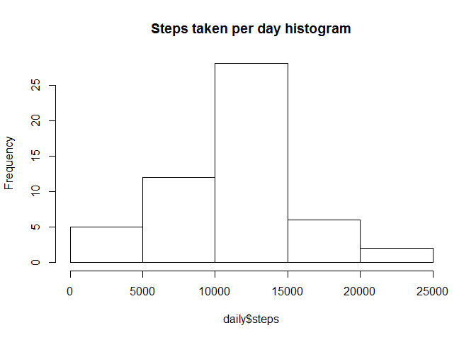
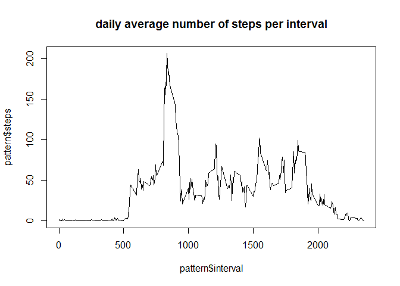
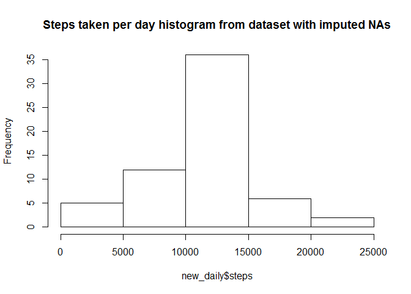
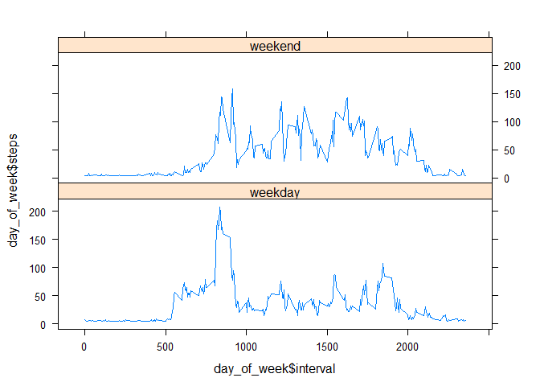

# Reproducible Research: Peer Assessment 1

## Loading and preprocessing the data
- read an unzipped activity.csv
- convert data variable to POSIXct
- keep *AM* dataset as an original data
- create *f()* function to control format of inline display of numbers
- create *d()* function to assign weekday of weekend

```r
setwd("~/R/Coursera/r_work/repdata-035/RepData_PeerAssessment1")
suppressMessages(library(dplyr)) # suppress output with dplyr warnings 
library(lattice)
AM <- read.csv("activity.csv")
AM$date <- as.POSIXct(strptime(as.character(AM$date),"%Y-%m-%d"))
f <- function (number) return (format(round(number, digits=2), big.mark=","))
d <- function (date) return (if(weekdays(date) %in% c("Sunday","Saturday")) "weekend" else "weekday")
```

## What is mean total number of steps taken per day?
- create *daily* dataset with sums of steps per day
- draw histogram
- create *daily.median* and *daily.mean* with removed NAs for inline display under the code chunk area

```r
daily <- AM %>% group_by(date) %>% summarize(steps = sum(steps))
hist(daily$steps, main = "Steps taken per day histogram")
```

 

```r
daily.mean <- mean(daily$steps, na.rm = TRUE)
daily.median <- median(daily$steps, na.rm = TRUE)
```

Steps per day mean value is **10,766.19**, median value is **10,765**

## What is the average daily activity pattern?
- create *pattern* dataset with steps mean per interval
- plot mean values per interval in timeseries style 

```r
pattern <- AM %>% group_by(interval) %>% summarize(steps = mean(steps, na.rm = TRUE))
plot(pattern$interval, pattern$steps, type = "l", main = "daily average number of steps per interval")
```

 

The maximum number of steps **206.17** is contained in **835** interval

## Imputing missing values
- caclulate number of rows with missing values for subsequent inline display after the code chunk area
- create *new_AM* dataset, impute NAs with steps mean per interval
- plot the histogram with new dataset
- calculate *new_daily.mean* and *new_daily.median* for inline display below code chunk area

```r
NofNA <- sum(!complete.cases(AM))
new_AM <- group_by(AM,interval)
new_AM[!complete.cases(AM),1] <- mean(new_AM$steps, na.rm = TRUE)
new_daily <- new_AM %>% group_by(date) %>% summarize(steps = sum(steps))
hist(new_daily$steps, main = "Steps taken per day histogram from dataset with imputed NAs")
```

 

```r
new_daily.mean <- mean(new_daily$steps)
new_daily.median <- median(new_daily$steps)
```
There are **2,304** rows with NAs in the original dataframe
After correction, steps per day mean value is **10,766.19**, median value is **10,766.19**
There is a slight difference, imputed interval-averaged dataset has equal mean and median, whereas dataset with NAs has slighlty differing values for mean and median (both computed with omitted NAs). The total number of steps per day is obviously higher, as it is shown on histogrames (approx 35 vs 25 in 10000-15000 bin)

## Are there differences in activity patterns between weekdays and weekends?
- use (ungrouped) *new_AM* dataset containig imputed values
- add factor column *day* using *d()* function defined in the first chunk
- group_by *interval* and *day* to summarize steps (mean)
- use xyplot from lattice package

```r
day_of_week <- ungroup(new_AM)
day_of_week$day <- as.factor(sapply(day_of_week$date, d))
day_of_week <- day_of_week %>% group_by(interval,day) %>% summarize(steps = mean(steps)) 
xyplot(day_of_week$steps ~ day_of_week$interval | day_of_week$day, layout=c(1,2), type="l")
```

 

there is obvious difference, on weekdays there is a morning spike probably due to commuting activity, with low values during work hours. On weekends there is no morning spike with higher average activity values during the day hours.

Created in the following environment:

```r
do.call("rbind", lapply(R.Version(), as.data.frame))
```

```
##                                      X[[i]]
## platform                 x86_64-w64-mingw32
## arch                                 x86_64
## os                                  mingw32
## system                      x86_64, mingw32
## status                                     
## major                                     3
## minor                                   2.2
## year                                   2015
## month                                    08
## day                                      14
## svn rev                               69053
## language                                  R
## version.string R version 3.2.2 (2015-08-14)
## nickname                        Fire Safety
```


